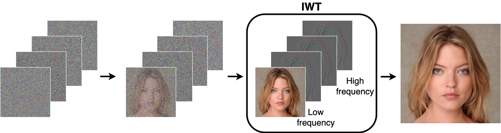

##### Table of contents
1. [Installation](#Installation)
2. [Dataset preparation](#Dataset-preparation)
3. [How to run](#How-to-run)
4. [Results](#Results)
5. [Evaluation](#Evaluation)
6. [Acknowledgments](#Acknowledgments)
7. [Contacts](#Contacts)

# Official PyTorch implementation of "Wavelet Diffusion Models are fast and scalable Image Generators"
<div align="center">
    
</div>

WaveDiff is a novel wavelet-based diffusion structure that employs low-and-high frequency components of wavelet subbands from both image and feature levels. These are adaptively implemented to accelerate the sampling process while maintaining good generation quality. Experimental results on CelebA-HQ, CIFAR-10, LSUN-Church, and STL-10 datasets show that WaveDiff provides state-of-the-art training and inference speed, which serves as a stepping-stone to offering real-time and high-fidelity diffusion models.


Details of the model architecture and experimental results can be found in [our following paper](https://arxiv.org/abs/2211.16152):
```bibtex
@article{hao2022wavelet,
  title={Wavelet Diffusion Models are fast and scalable Image Generators},
  author={Hao Phung and Quan Dao and Anh Tran},
  journal={Proceedings of the IEEE/CVF Conference on Computer Vision and Pattern Recognition (CVPR)},
  year={2023}
}
```
 **Please CITE** our paper whenever this repository is used to help produce published results or incorporated into other software.

## Installation ##
Python `3.7.13` and Pytorch `1.10.0` are used in this implementation.

It is recommended to create `conda` env from our provided [environment.yml](./environment.yml):
```
conda env create -f environment.yml
conda activate wavediff
```

Or you can install neccessary libraries as follows:
```bash
pip install -r requirements.txt
```
For `pytorch_wavelets`, please follow [here](https://github.com/fbcotter/pytorch_wavelets.git).

## Dataset preparation ##
We trained on four datasets, including CIFAR10, STL10, LSUN Church Outdoor 256 and CelebA HQ (256 & 512). 

For CIFAR10 and STL10, they will be automatically downloaded in the first time execution. 

For CelebA HQ (256) and LSUN, please check out [here](https://github.com/NVlabs/NVAE#set-up-file-paths-and-data) for dataset preparation.

For CelebA HQ (512 & 1024), please download data at [here](https://drive.google.com/file/d/1E23HCNL-v9c54Wnzkm9yippBW8IaLUXp/view?usp=share_link) and then generate [LMDB](https://lmdb.readthedocs.io/en/release/) format dataset by [Torch Toolbox](https://github.com/PistonY/torch-toolbox#5-make-and-use-lmdb-dataset). 

Once a dataset is downloaded, please put it in `data/` directory as follows:
```
data/
├── STL-10
├── celeba
├── celeba_512
├── celeba_1024
├── cifar-10
└── lsun
```

## How to run ##
We provide a bash script for our experiments on different datasets. The syntax is following:
```
bash run.sh <DATASET> <MODE> <#GPUS>
```
where: 
- `<DATASET>`: `cifar10`, `stl10`, `celeba_256`, `celeba_512`, `celeba_1024`, and `lsun`.
- `<MODE>`: `train` and `test`.
- `<#GPUS>`: the number of gpus (e.g. 1, 2, 4, 8).

Note, please set argument `--exp` correspondingly for both `train` and `test` mode. All of detailed configurations are well set in [run.sh](./run.sh). 

**GPU allocation**: Our work is experimented on NVIDIA 40GB A100 GPUs. For `train` mode, we use a single GPU for CIFAR10 and STL10, 2 GPUs for CelebA-HQ 256, 4 GPUs for LSUN, and 8 GPUs for CelebA-HQ 512 & 1024. For `test` mode, only a single GPU is required for all experiments.

## Results ##
Model performance and pretrained checkpoints are provided as below:
<table>
  <tr>
    <th>Model</th>
    <th>FID</th>
    <th>Recall</th>
    <th>Time (s)</th>
    <th>Checkpoints</th>
  </tr>
  <tr>
    <td>CIFAR-10</td>
    <td>4.01</td>
    <td>0.55</td>
    <td>0.08</td>
    <td><a href="https://www.dropbox.com/sh/d1h1b9y0hjptnju/AABCdqJWnTq45uK2SRr6S_qGa?dl=0">netG_1300.pth</a></td>
  </tr>
  <tr>
    <td>STL-10</td>
    <td>12.93</td>
    <td>0.41</td>
    <td>0.38</td>
    <td><a href="https://www.dropbox.com/sh/wo72rvmfyzam8hx/AADzfJMnFTp61KpFGeErd5Dta?dl=0">netG_600.pth</a></td>
  </tr>
  <tr>
    <td>CelebA-HQ (256 x 256) </td>
    <td>5.94</td>
    <td>0.37</td>
    <td>0.79</td>
    <td><a href="https://www.dropbox.com/sh/x32f74anuvglyat/AAAcrrRy5MySj39ZELd23q5Oa?dl=0">netG_475.pth</a></td>
  </tr>
  <tr>
    <td>CelebA-HQ (512 x 512) </td>
    <td>6.40</td>
    <td>0.35</td>
    <td>0.59</td>
    <td><a href="https://www.dropbox.com/sh/r1ysz9u1kxla4qo/AAC6WjygEn31BhoNy4UfeRvca?dl=0">netG_350.pth</a></td>
  </tr>
  <tr>
    <td>LSUN Church</td>
    <td>5.06</td>
    <td>0.40</td>
    <td>1.54</td>
    <td><a href="https://www.dropbox.com/sh/nr44t8pwnf5xyxd/AACn0CJ-xa4ctr4oD5hrGhSqa?dl=0">netG_400.pth</a></td>
  </tr>
  <tr>
    <td>CelebA-HQ (1024 x 1024) </td>
    <td>5.98</td>
    <td>0.39</td>
    <td>0.59</td>
    <td><a href="https://www.dropbox.com/s/1t2emfaoveormt1/netG_350.pth?dl=0">netG_350.pth</a></td>
  </tr>
</table>

Inference time is computed over 300 trials on a single NVIDIA A100 GPU for a batch size of 100, except for the one of high-resolution CelebA-HQ (512 & 1024) is computed for a batch of 25 samples.

Downloaded pre-trained models should be put in `saved_info/wdd_gan/<DATASET>/<EXP>` directory where `<DATASET>` is defined in [How to run](#how-to-run) section and `<EXP>` corresponds to the folder name of pre-trained checkpoints.

## Evaluation ##
### Inference ###
Samples can be generated by calling [run.sh](./run.sh) with `test` mode.

### FID ###
To compute fid of pretrained models at a specific epoch, we can add additional arguments including ```--compute_fid``` and ```--real_img_dir /path/to/real/images``` of the corresponding experiments in [run.sh](./run.sh).

### Recall ###
Thanks to Xiao et al for releasing their official implementation of the [DDGAN](https://github.com/NVlabs/denoising-diffusion-gan.git) paper. For wavelet transformations, we utilize implementations from [WaveCNet](https://github.com/LiQiufu/WaveCNet.git) and [pytorch_wavelets](https://github.com/fbcotter/pytorch_wavelets.git).

## Acknowledgments
Thanks to Xiao et al for releasing their official implementation of the [DDGAN](https://github.com/NVlabs/denoising-diffusion-gan.git) paper.

## Contacts ##
If you have any problems, please open an issue in this repository or ping an email to [tienhaophung@gmail.com](mailto:tienhaophung@gmail.com).
